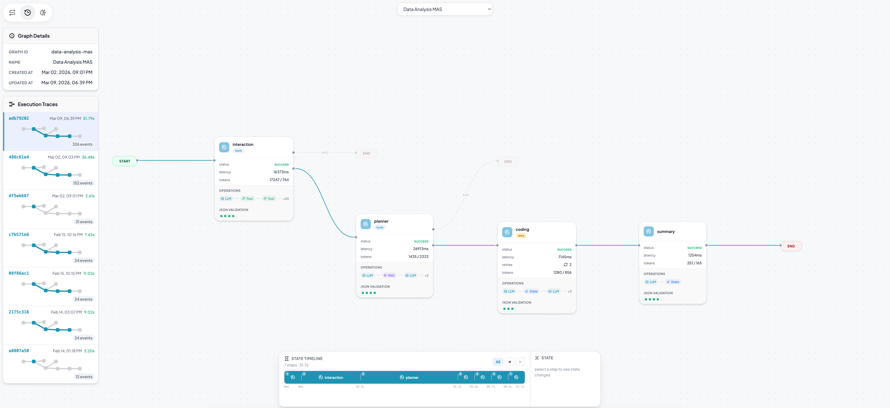
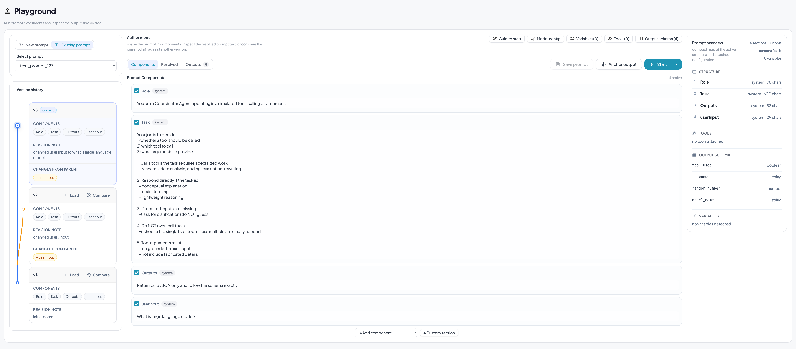

# Tracee

An observability and prompt-engineering toolkit for multi-agent systems built on LangGraph.

Existing applications usually provide poor navigation and little visibility into your system structure. Tracee introduces a new way of navigating your LangGraph execution traces by providing a **Graph** page that allows you to visualize the execution of your workflow. It also provides a **Playground** page that allows you to author and experiment with prompts, and a **Prompts** page that allows you to browse and compare your saved prompts.

<p>
  
  
</p>

## Why Tracee

Agentic workflows built on frameworks like LangGraph are powerful, but developing them is slow because iteration happens in two loops. First comes the inner loop: developers work on one agent at a time, repeatedly testing, observing outputs, and refining its prompt until that agent behaves reliably enough. Then comes the outer loop: they run the full workflow, trace how agents interact, watch for failures and edge cases, and feed what they learn back into prompt refinement. Much of the time is spent moving between these two loops under stochastic behavior, where small prompt changes can have unclear effects and one weak agent can destabilize the whole system.

The **Playground** is designed for the inner loop: the repeated process of testing one agent, observing its outputs, and refining its prompt. It lets you iterate on prompts, run them against a live model, compare outputs side by side, inspect output patterns in a scatter plot, and save versions without touching your application code.

The **Graph Viewer** is designed for the outer loop. It separates what your system *is* from what it *did* by combining three layers:

- **Intent layer** — the static topology of your compiled workflow, including paths that may not execute in a given run.
- **Execution layer** — the runtime trace of a specific invocation, overlaid on the intent graph so you can see exactly which path was taken.
- **Cognition layer** — an AI-supported analysis of a completed trace, summarizing decisions at both the node and trace level.


## Setup Guide

### Prerequisites

- Python 3.11 or later
- [uv](https://docs.astral.sh/uv/) (recommended) or pip as your package manager
- A LangGraph workflow you want to instrument (`langgraph` installed in your project)
- An OpenAI API key if you plan to use the Playground or Cognition analysis features

### 1. Clone the repository

```bash
git clone https://github.com/fig-x/tracee.git
cd tracee
```

### 2. Install the package

We recommend using [uv](https://docs.astral.sh/uv/) for fast, reliable dependency management.

```bash
uv add 'tracee[server]'
```

### 3. Start the server

The built-in UI is served automatically — no separate frontend build step required.

```bash
tracee serve
```

Override the port and host:

```bash
tracee serve --port 8000 --host 0.0.0.0
```

Open `http://localhost:8000` in your browser. The Graph page will be empty until you register a workflow.

### 4. Configure environment

The server loads a `.env` file from the working directory on startup.

```bash
# .env (in the directory where you run tracee serve)
OPENAI_API_KEY=sk-...
```

| Variable | Description |
|----------|-------------|
| `OPENAI_API_KEY` | Required for Playground runs and Cognition analysis. |
| `TRACE_DB_PATH` | Override the SQLite database location. |
| `TRACEE_COGNITION_MODEL` | LLM model for cognition analysis (defaults to `gpt-4o-mini`). |

### 5. Instrument your LangGraph app

Import `tracee`, register the compiled graph, and wrap invocations with `tracee.trace()`.

```python
import tracee

# compile your LangGraph workflow as usual
app = workflow.compile()

# register the graph topology with the Tracee server
tracee.init(
    app,
    graph_id="my-workflow",
    name="My Workflow",
)

# wrap any invocation in tracee.trace() to record it
with tracee.trace():
    result = app.invoke(initial_state)
```

- `tracee.init()` publishes the graph topology and patches `invoke` / `ainvoke` to attach tracing callbacks.
- `tracee.trace()` records the full execution and streams events to the server.

### 6. Verify the connection

After running your instrumented app at least once:

1. **Check the Graph page** — Your workflow topology should appear with agent nodes and edges.
2. **Switch to Execution layer** — Select your trace from the dropdown and replay the execution step by step.
3. **Try the Playground** — Create a simple prompt to confirm the server can reach the LLM API.

## License

See [LICENSE](LICENSE) for details.
